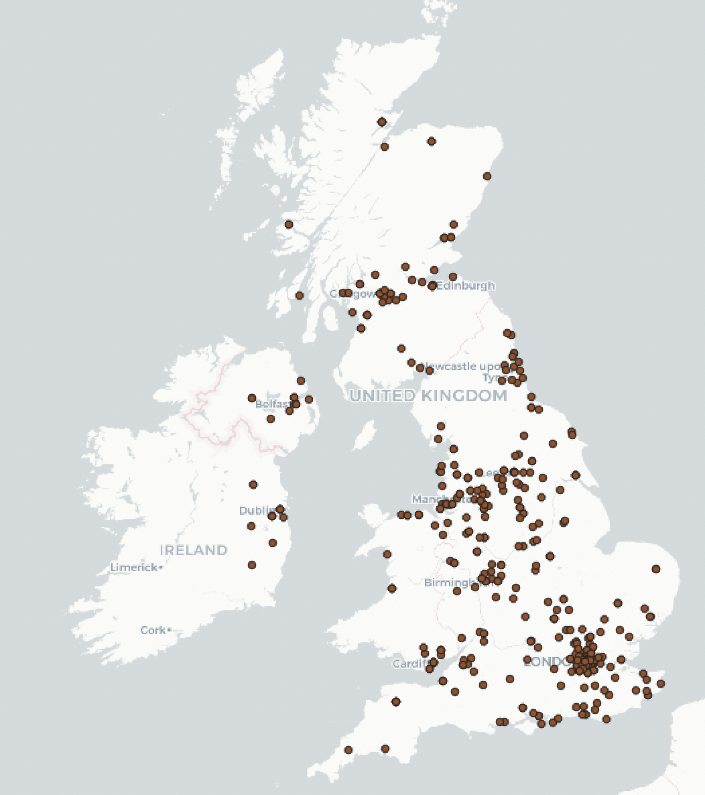
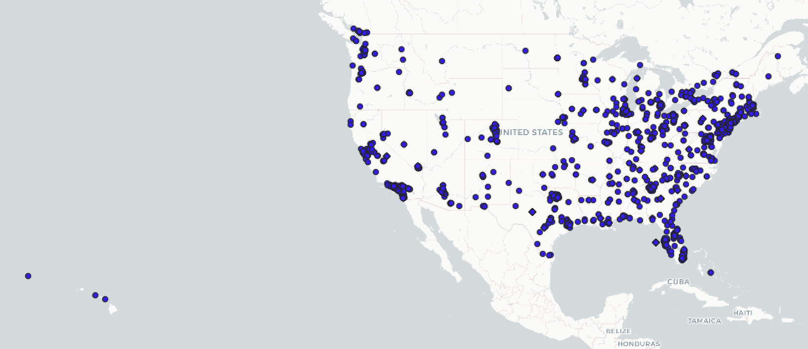
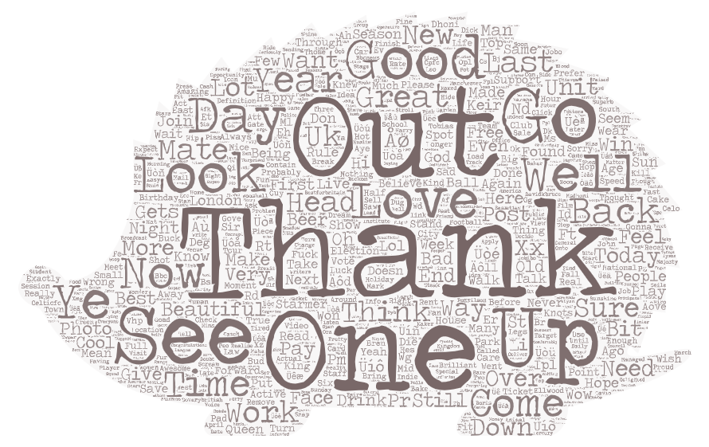

# tweet_word_cloud
## Introduction
In this repository, we use tweepy to crawl tweets in a real-time manner. We crawled tweets posted by users in United Kingdom and United States, respectively. We executed the crawler at 08:30 April 21, 2022 (UTC). Then we used QGIS to map our crawled tweets. Finally, we use Word Cloud to visualize what people are trending on Twitter in both countries.

We select United States and United Kingdom to test our crawler because we are interested to see what people in both countries are trending online at the same time. Since our crawler filters English tweets, we believe crawling English contents in English-speaking countries bears least biase compared with crawling English contents in non English-speaking countries.

## Comparing the Maps
Below please see the mapping of the geo-tagged data. Apparently, the density of dots correlates with population distribution. In US, dots are mostly clustered on coasts and major inland cities, while in UK, we observe clusters around London.
  
  

## Comparing the Word Clouds
It is interesting to see what topics are people in US and UK are trending most. As we can see from the word cloud below, people in UK are mostly expressing gratitudes to others (A big "Thank" in the center of the word cloud), while in the US, people are more expressive of their own lives, job and work are most common words in US twitter platform.
  
  